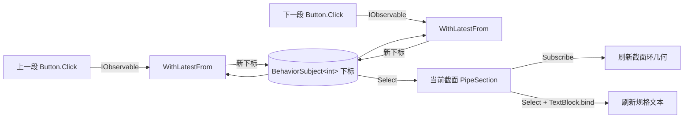

# PipeSections 项目开发记录

> 目标：创建一个 F# 手动加载 WPF XAML 的演示项目 `PipeSections`（管道截面查看器），主窗口采用 `MetroWindow` 与响应式绑定。

## 一、最终项目结构（一个 XAML 名称 ↔ 一个 .fs 名称）

```
PipeSections/
├── PipeSections.fsproj          # 项目配置：XAML 为 EmbeddedResource + 依赖 + 主库引用
├── App.xaml / App.fs            # 应用层：MahApps 资源合并 + 嵌入资源 XAML 加载
├── MainWindow.xaml / MainWindow.fs  # 窗口层：MetroWindow + 响应式绑定
├── PipeSection.fs               # 业务层：管道截面数据与换算逻辑
└── Program.fs                   # 入口层：STAThread 启动
```

各文件职责：

| 文件 | 职责 |
|---|---|
| `PipeSections.fsproj` | `WinExe` / `net10.0-windows` / `UseWPF`；`App.xaml`、`MainWindow.xaml` 设为 `EmbeddedResource`（避免 F# 无代码后置导致的 Page 编译冲突）；编译项按依赖顺序：`PipeSection.fs → App.fs → MainWindow.fs → Program.fs` |
| `App.xaml` ↔ `App.fs` | 应用层：合并 MahApps.Metro 资源字典；`loadXaml` 用 `XamlLoader.loadXaml` 从嵌入资源手动加载 XAML，创建 `Application` 实例 |
| `MainWindow.xaml` ↔ `MainWindow.fs` | 窗口层：根元素 `metro:MetroWindow`；`createWindow()` 查找控件，用 Rx 响应式绑定驱动截面环与文本 |
| `PipeSection.fs` | 业务层：管道截面数据模型、规格列表、mm→画布半径换算、显示文本（纯逻辑，无窗口依赖） |
| `Program.fs` | 入口层：`[<STAThread>]` + `DispatcherSynchronizationContext`，装配 app 与 window 启动 |

## 二、实现步骤

### 1. 创建项目与依赖配置（`PipeSections.fsproj`）

- `OutputType` 为 `WinExe`，目标框架 `net10.0-windows`，`UseWPF=true`。
- `App.xaml`、`MainWindow.xaml` 从默认 `Page` 移除，改为 `EmbeddedResource`，由代码手动加载。
- 依赖：`MahApps.Metro 2.4.11`、`FSharp.Idioms 1.5.17`、`FSharp.Core 10.1.400`，并 `ProjectReference` 引用主库 `..\FSharp.ReactiveWpf\FSharp.ReactiveWpf.fsproj`（`System.Reactive` 随主库传递引用）。

### 2. 应用层（`App.xaml` + `App.fs`）

- `App.xaml` 合并 MahApps.Metro 资源字典（Controls / Fonts / Dark.Blue 主题），为 Metro 控件提供样式。
- `App.fs` 通过主库 `XamlLoader.loadXaml` 从**嵌入资源**加载 XAML：

```fsharp
let assy = Assembly.GetExecutingAssembly()

let loadXaml filename =
    "PipeSections." + filename
    |> XamlLoader.loadXaml assy

let app = loadXaml "App.xaml" :?> Application
```

### 3. 业务层（`PipeSection.fs`）

- 定义截面模型 `{ Name; OuterDiameter; WallThickness }` 与六种规格（DN50 ~ DN300）。
- 提供纯逻辑函数：`radii`（mm 直径 → 画布半径）与 `description`（规格显示文本）。

### 4. 窗口层（`MainWindow.xaml` + `MainWindow.fs`）

- `MainWindow.xaml`：根元素 `metro:MetroWindow`，含规格文本、空心截面环（`GeometryGroup` EvenOdd 规则）、「上一段 / 下一段」按钮。
- `MainWindow.fs`：`createWindow()` 加载窗口、`FindName` 查找控件，用 Rx 响应式数据流：

```fsharp
let index = new BehaviorSubject<int>(2)                     // 当前截面下标

(prevButton.Click :?> IObservable<_>)                        // 点击流 → 新下标
    .WithLatestFrom(index, fun _ i -> (i - 1 + count) % count)
    .Subscribe(fun i -> index.OnNext(i))
    |> disposable.Add

let current = index.Select(fun i -> PipeSection.sections[i]) // 推导当前截面

current.Subscribe(fun s -> ...)                              // 响应式刷新截面环几何
TextBlock.bind disposable infoText (...)                     // 响应式绑定文本
```

- 事件统一通过 `Click :?> IObservable<_>` 处理；订阅全部纳入 `CompositeDisposable`，窗口关闭时释放。
- 文本使用主库 `TextBlock.bind`（自带去重、50ms 节流、UI 线程调度）。

### 5. 入口层（`Program.fs`）

- 设置 `DispatcherSynchronizationContext`，`[<STAThread>]` 入口装配 `App.app` 与 `MainWindow.createWindow()` 后 `app.Run(window)`。

### 6. 加入解决方案

- `dotnet sln add` 将 `PipeSections\PipeSections.fsproj` 加入 `FSharp.ReactiveWpf.slnx`。

## 三、响应式数据流



## 四、验证

- `dotnet build`：**0 警告 0 错误**。
- 运行时冒烟测试：启动数秒无崩溃，XAML 嵌入资源加载、`MetroWindow` 解析、响应式绑定均正常。

## 五、运行方式

```powershell
dotnet run --project PipeSections
```

或 Visual Studio 打开 `FSharp.ReactiveWpf.slnx`，将 `PipeSections` 设为启动项目后按 F5。窗口为深蓝色 Metro 风格，点击「上一段 / 下一段」响应式切换管道截面环与规格文本。
